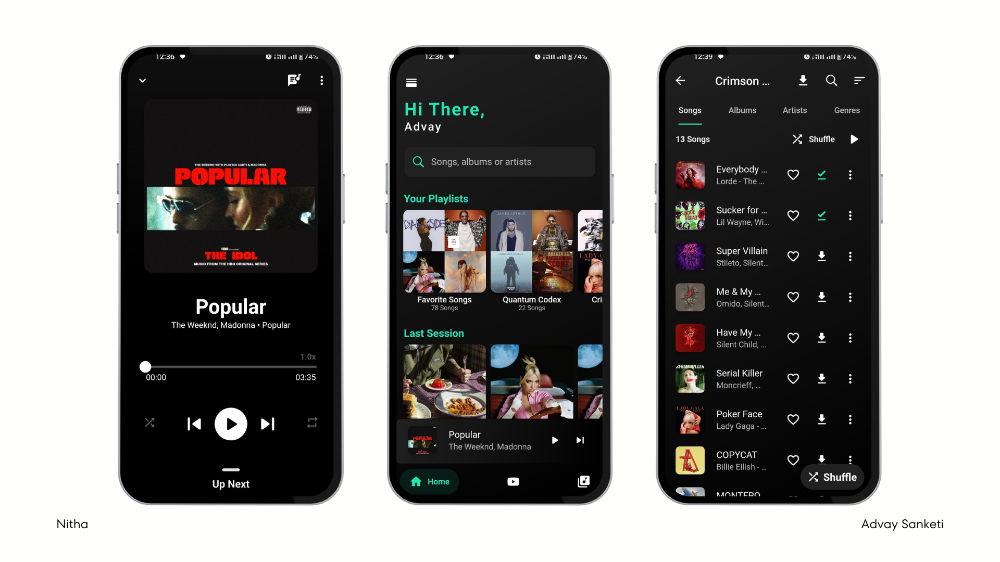

# 🎵 Nitha - Ad-Free Music Streaming App

**Nitha** is a music streaming app built with Flutter, offering an **ad-free and subscription-free** listening experience. Inspired by Blackhole, it allows users to enjoy unlimited music from multiple platforms without interruptions.

## 📸 **Screenshots**

---

## 🚀 Features

✅ **Ad-Free Streaming** – Enjoy music without annoying ads.  
✅ **No Paid Subscriptions** – Listen to unlimited songs for free.  
✅ **Offline Playback** – Download tracks and listen without the internet.  
✅ **High-Quality Audio** – Supports multiple bitrates for the best experience.  
✅ **Custom Playlists** – Organize your favorite songs easily.  
✅ **Dark Mode Support** – Choose between light and dark themes.

## 🛠 Tech Stack

- **Flutter & Dart** – For a smooth cross-platform experience.
- **Just Audio & Audio Service** – For seamless music playback.
- **SQLite & Hive** – For offline storage of playlists and downloads.
- **API Integration** – Fetches music from multiple sources.

## 📌 How It Works

1. **Fetches Music** – Gets streaming URLs from platforms like Spotify, Saavn, and YouTube.
2. **Plays in Background** – Works even when the app is minimized.
3. **Offline Storage** – Saves songs locally for offline listening.
4. **Custom UI & Player** – Provides a fast, intuitive, and clean interface.

---

## 🌟 Contributing

Feel free to fork this repo and submit a pull request! Any improvements are welcome.

---

## 📜 License

This project is licensed under the GPL-3.0 License. Feel free to use and modify it as you like.

---

## ⭐ Connect

👨‍💻 GitHub: [@AdvaySanketi](https://github.com/AdvaySanketi)
